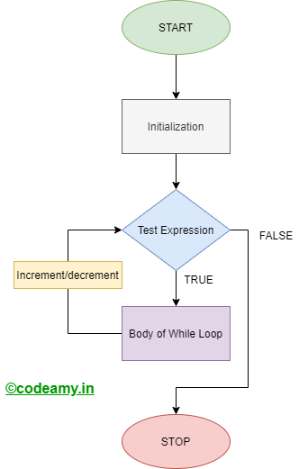

# In de herhaling vallen … while-loops

## Herhalingen zijn best leuk   

Om te voorkomen dat je regels code eindeloos moet herhalen, want een computer programma leest de code altijd van boven naar beneden,  
zijn er een aantal manieren om herhalingen van code weer te geven.  

In dit hoofdstuk behandelen we de [while loop](while.ipynb) en de do while loop.  
Verder ga je het spel Steen-Papier-Schaar dat je eerder hebt gemaakt, zo aanpassen dat je het een aantal keren speelt.
Tot slot maak je nog een aantal afsluitende opdrachten die je weer in teams inlevert.  

